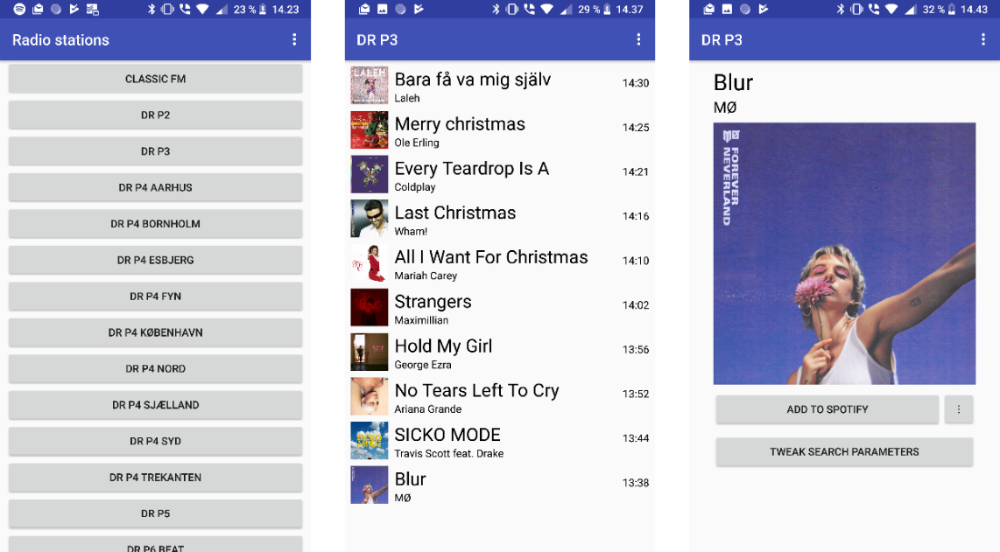

# SpotyFM

SpotyFM is an app for android that makes it easy to find that song you just listened to on the radio (Currently only available for certain radio stations in Denmark)

This project was made as an exam project on my Android course.

## Current features

- Connect with Spotify account
  - Load users playlists
  - Save songs to users library or a selected playlist
- Show 10 last playing tracks for a radio station
- Load album covers from Spotify image API
- Select specific time so search for
- Tweak search for a song that was not properly matched

## Future plans

I want to release a prettier version someday on Android and IOS but for now, this is fine for me.

## Development

The app is written in Java in Android Studio over a period of approximately 3 months.

I used Firebase firestore to store the available radio stations, so I can add and remove supported channels without updating the app.

## Download

If you would like to try the app, and have an Android Phone you can download and install the .apk below

[Download](https://github.com/blorsten/SpotyFM/releases)